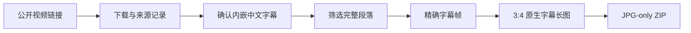

<div align="center">
  
</div>

# Xiaohongshu Native Subtitle From Link

给一个带画面内嵌中文字幕的公开视频链接，生成若干张独立的小红书原生字幕长图和只含成品 JPG 的发布包。

[](./SKILL.md)
[](./requirements.txt)
[](./LICENSE)
[](./CHANGELOG.md)

> 这里的“原生字幕”是指字幕已经烧录在视频画面里。Skill 从真实字幕出现的稳定帧裁切并拼接，不重绘、不改写，也不伪造字幕。

[English overview](./README.en.md)

## 一条链接会变成什么



默认筛选成长、学习、行动、创造、习惯、工作方法与人生感悟等完整段落。一个完整观点对应一张独立 JPG；数量由内容决定，不强行凑固定张数。

## 前提与边界

- 视频必须能通过普通公开访问获得，或者由用户提供合法本地文件。
- 中文字幕必须已经出现在画面里；外部字幕只能辅助定位。
- 用户提供链接不等于拥有再发布权。默认只制作草稿包，不自动登录或发布。
- 不绕过登录、付费、地区或其他访问控制。
- 不通过覆盖、涂抹或生成手段去除水印、Logo、二维码或人物标识；无法通过选帧和裁切安全避开的内容应放弃。

## 一分钟开始

### 1. 安装

```bash
git clone https://github.com/rui8001/xiaohongshu-native-subtitle-from-link.git \
  ~/.codex/skills/xiaohongshu-native-subtitle-from-link

python3 -m venv ~/.codex/skills/xiaohongshu-native-subtitle-from-link/.venv
~/.codex/skills/xiaohongshu-native-subtitle-from-link/.venv/bin/pip install \
  -r ~/.codex/skills/xiaohongshu-native-subtitle-from-link/requirements.txt
```

### 2. 调用

```text
$xiaohongshu-native-subtitle-from-link
把这个带内嵌中文字幕的公开视频按原生字幕方式做成小红书图文：
https://example.com/public-video
```

也可以直接说“按之前方式做这个链接”。Skill 会先验证视频和可见字幕，再继续所有合格段落。

### 3. 得到的目录

```text
outputs/2026-08-25-topic/
├── source-record.md
├── candidates.md
├── native-subtitle-times.json
├── render/
│   ├── 01_完整观点.jpg
│   ├── 02_另一个完整观点.jpg
│   └── final_contact_sheet.jpg
├── publish/
│   ├── 01_完整观点.jpg
│   └── 02_另一个完整观点.jpg
└── publish.zip
```

## 内置工具

这次发布已把原来的“链接工作流”和“原生字幕渲染器”合并在同一个 Skill 内部。使用者只需下载这一个仓库。

| 工具 | 作用 |
| --- | --- |
| `scripts/fetch_source` | 下载单个公开源、信息 JSON 和可用字幕轨 |
| `scripts/json3_to_timeline.py` | 把 JSON3 转为便于定位的时间线 |
| `scripts/native_subtitle_stitch.py` | 预览字幕区、精确取帧、拼接 3:4 长图与总览图 |
| `scripts/package_publish_images.py` | 只把编号 JPG 放进发布目录和 ZIP |

完整命令和参数见 [工作流文档](./references/workflow.md)。公开的 [manifest 示例](./examples/native-subtitle/manifest.json) 与 [JSON3 示例](./examples/native-subtitle/sample.json3) 可用于理解格式。

## 质量标准

- 每张图都能独立表达一个完整观点，不拼接互不相关的话。
- 时间点严格递增，字幕清楚、稳定、无重复和转场残影。
- 首帧保留主体与语境，其余帧紧凑保留真实字幕条。
- 避免黑边、突兀裁脸、姓名条、Logo、二维码和无关品牌。
- 默认输出 1440×1920 JPG，并逐张检查总览图。
- 发布包只含编号 JPG；manifest、预览和总览保留在质检目录。

## 仓库结构

```text
xiaohongshu-native-subtitle-from-link/
├── SKILL.md
├── agents/openai.yaml
├── scripts/
├── references/
├── examples/
├── assets/
├── requirements.txt
└── CHANGELOG.md
```

## 隐私、版权与安全

仓库不包含真实下载视频、发布账号、Cookie、API Key、个人路径、私有作品、作者素材或成品图片。不要把登录 Cookie 或带身份信息的下载参数贴到公开 Issue。详见 [SECURITY.md](./SECURITY.md)。

## Roadmap

- 增加更多安全的合成视频回归样例
- 增加自动生成来源记录和候选段落清单
- 增加不同字幕位置、横竖屏和多人画面的公开示例
- 增加可选的尺寸预设，同时保留原字幕不重绘原则

## License

[MIT](./LICENSE) © 2026 rui8001
